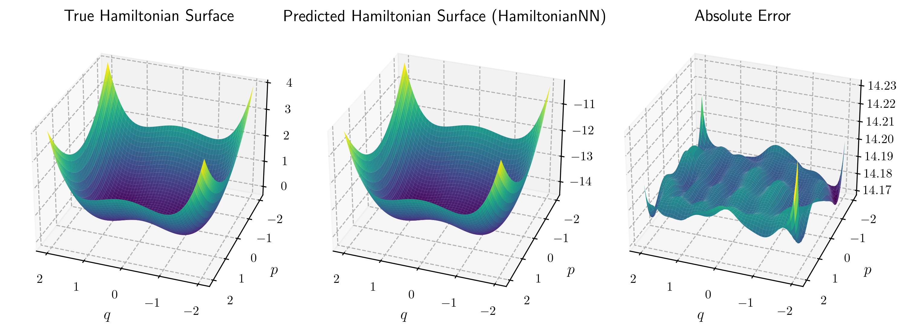
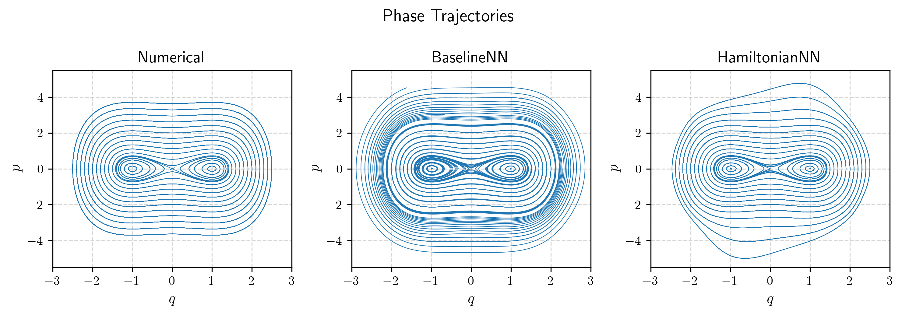
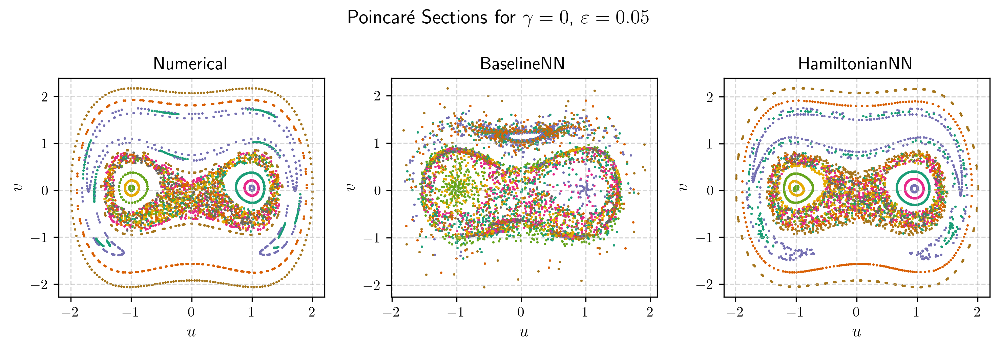
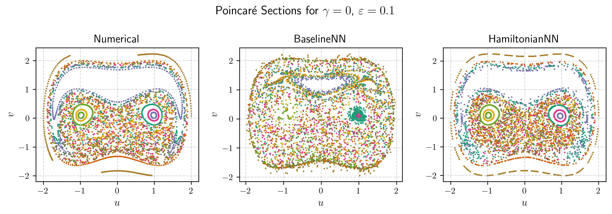
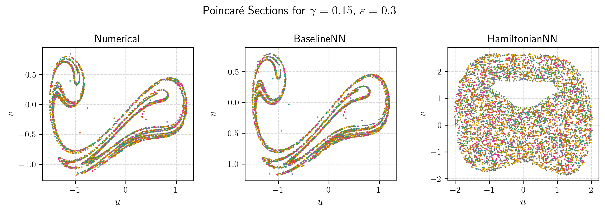

# Hamiltonian Neural Network for the Duffing Oscillator

This project explores the use of **Hamiltonian Neural Network** to learn and simulate the dynamics of the **Duffing oscillator** and compares their performance to baseline neural network.

## Overview

The Duffing oscillator is a nonlinear second-order system. The goal of this project is to:

- Learn the vector field of the system using two types of neural networks:
  - **BaselineNN**: Predicts derivatives directly.
  - **HamiltonianNN**: Learns the Hamiltonian and derives equations via automatic differentiation.
- Compare the learned dynamics with numerical simulations (ground truth).

## Conservative Duffing Oscillator

The system is defined by the Hamiltonian:

```math
H(q, p) = \frac{p^2}{2} - \frac{q^2}{2} + \frac{q^4}{4}.
```

Corresponding equations of motion:

```math
\dot{q} = \frac{\partial H}{\partial p} = p, \quad
\dot{p} = -\frac{\partial H}{\partial q} = q - q^3.
```

Here, $q$ and $p$ are the canonical coordinate and momentum.

The figure below shows the true Hamiltonian of the conservative Duffing system, the Hamiltonian predicted by the HamiltonianNN, and the absolute error between the two. Although the predicted surface closely matches the true one, the error is not necessarily centered around zero, since the Hamiltonian is defined up to an arbitrary constant.

<p align="center">
  
</p>

Below are phase trajectories generated by the numerical solver, BaselineNN, and HamiltonianNN. The trajectories from the numerical solver are closed curves — a consequence of the Hamiltonian structure, or, what is the same in this case, equivalently conservation of phase-space volume. BaselineNN fails to preserve this structure: its trajectories are noticeably open. In contrast, HamiltonianNN produces closed trajectories, that preserve energy along their path, even for initial conditions outside the training region, indicating strong generalization due to the learned physical prior — although the trajectories may be significantly deformed compared to the true ones.

<p align="center">
  
</p>

## Chaotic Duffing Oscillator

This version includes damping and a periodic external force:

```math
\dot{u} = v, \quad
\dot{v} = -\gamma v + u - u^3 + \varepsilon \sin t,
```

where $u$ and $v$ represent the coordinate and velocity, respectively, $\gamma$ is the damping coefficient, $\varepsilon$ is the amplitude of the external periodic force.

The following plots compare Poincaré sections for the case $\gamma = 0$ and two values of $\varepsilon$. The HamiltonianNN correctly captures the qualitative structure of the flow in phase space and produces Poincaré sections that closely resemble the numerical results. BaselineNN, however, fails to replicate the Hamiltonian structure of the system.

<p align="center">
  
  
</p>

The case below corresponds to a Duffing oscillator with both dissipation and external forcing. The system exhibits a strange attractor in its Poincaré section. Since HamiltonianNN is inherently volume-preserving, it cannot model the dissipative dynamics and thus produces an incorrect Poincaré map. BaselineNN, on the other hand, accurately reproduces the strange attractor in the Poincaré section, indicating that it has effectively learned the dominant behavior of the system.

<p align="center">
  
</p>

## Installation

Clone the repository:

```bash
git clone https://github.com/avsakharov/hnn-duffing-oscillator.git
cd hnn-duffing-oscillator
```

## Libraries used

numpy, torch, matplotlib, tqdm, scipy, scikit-learn, random, os, math
